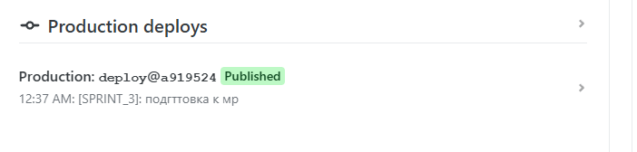

# Проект «Мессенджер» на курсе Яндекс.Практикум. Middle-frontend разработчик.

[Ссылка на github](https://github.com/IrinaSha/yandex-praktikum-middle.messenger.git)

[Ссылка на макет figma](https://www.figma.com/design/Ej5Gn4JGcJ6ZnafLhGVBNw/messenger_shabliy?node-id=1-498&m=dev&t=ltNywIHgbU0NZVnH-1)

[Ссылка на собранную версию Спринт 3](https://messenger-shabliy.netlify.app/) Но у меня ни в какую не грузится хотя собрано на нетлифай

---

## Описание

Представляет собой многостраничное приложение, реализующее функции обмена сообщениями между пользователями
При переходе по [ссылке](https://messenger-shabliy.netlify.app/) будет осуществлен переход к странице авторизации, если пользователь
уже авторизован то будет осуществлен переход к странице чатов. 

В приложении предусмотрен роутинг:
1) .use('/', LoginView, false)
2) .use('/sign-up', RegistrationView, false)
3) .use('/settings', ProfileView, true)
4) .use('/messenger', ChatsView, true)
5) .use('/messenger/:chatId', ChatsView, true)

а именно переход на следующие страницы
1) [Страница авторизации](https://messenger-shabliy.netlify.app/) стартовая страница, если пользователь 
уже авторизован то будет осуществлен переход к странице чатов
2) [Страница регистрации](https://messenger-shabliy.netlify.app/sign-up)
3) [Страница чатов](https://messenger-shabliy.netlify.app/messenger)
4) [Страница профиля пользователя](https://messenger-shabliy.netlify.app/settings)

### Предварительные требования

Убедитесь, что у вас установлены:

- Node.js v20.19.0 и выше. Скачайте его с [nodejs.org](https://nodejs.org/en).
- Git. Скачайте его с [git-scm.com](https://git-scm.com/).

## Разработка проекта

Для работы с проектом перейдите по [ссылке](https://github.com/IrinaSha/yandex-praktikum-middle.messenger.git)
и скачайте проект.

С помощью команды

`npm install`

установите требуемые зависимости. После успешной установки в папке проекта появится папка **node_modules**

## Используемые технологии

- Проект разрабатывается на языке TypeScript https://www.typescriptlang.org/
- В качестве сборщика используется Vite https://www.typescriptlang.org/
- Страницы разработаны с помощью шаблонизатора Handlebars https://handlebarsjs.com/
- Для описания стилей используется препроцессор https://sass-scss.ru/guide/
- Для разворачивания приложения в сети интернет используется сервис https://www.netlify.com/

## Запуск проекта

Команда для запуска проекта
"start": "npm run build && node ./server.js" (прописан в файле package.json можно запускать там)
можно запускать через терминал 
`npm start`

Команды для запуска линтеров (прописан в файле package.json)
"eslint": "eslint . --ext .ts --fix",
"stylelint": "npx stylelint \"./src/**/**.scss\" --cache --fix",
"lint": "npm run eslint && npm run stylelint"
